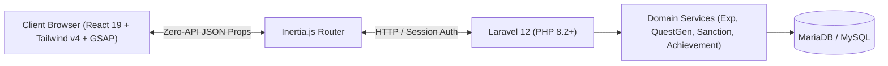

<p align="center">
  
</p>

<h1 align="center">⚔️ SchoolQuest ⚔️</h1>

<p align="center">
  <strong>Level Up Your School Life!</strong><br>
  <em>A Gamified Web Platform for Student Productivity, Classroom Cleaning Duty Discipline, and Student Engagement for Vocational High Schools Built on Laravel 12 & React 19.</em>
</p>

<p align="center">
  
  
  
  
  
  
  
  
</p>

---

## 🌟 About SchoolQuest

**SchoolQuest** is a modern web platform that applies game mechanics (*Gamification*) to the daily academic life of Vocational High School (SMK) students (specifically tailored for Software Engineering / RPL and Office Management / MPLB majors).

Instead of treating subject assignments and cleaning duty schedules as monotonous routines, SchoolQuest transforms them into exciting, rewarding **Quests**. Every task submitted by students and verified by teachers awards **Experience Points (EXP)**, increases **Level**, unlocks **14 Fantasy Ranks**, maintains a **Daily Streak**, and allows students to compete for top spots on the **3D Podium Leaderboard**.

---

## ✨ Key Features

### 🎮 For Students (The Adventurers)
- **Adventurer Dashboard:** Interactive level status card, dynamic EXP bar, daily streak counter, and today's subject schedule timeline.
- **Interactive Onboarding:** Guided adventure introduction modal for new students upon their initial login.
- **Automated Daily Quests:** Auto-generated daily quests based on class subject schedules and daily cleaning duty rosters.
- **Transparent Proof Submission:** Quest submission form supporting detailed text notes (*proof text*) and photo/screenshot uploads (*proof image*). Clear, transparent submission statuses: *Pending*, *Approved*, or *Rejected* with constructive teacher revision notes.
- **Leaderboard:** Top 3 podium (Gold, Silver, Bronze) with All-School view (220+ students) as well as inter-class filters.
- **The Realm (Community Hub):** Official student discussion forum featuring categorized topics, nested replies, likes, and content reporting.
- **Character Customization:** Random robotic avatar selection (DiceBear PixelBot) or custom photo upload, alongside self-service password management.

### 🛡️ For Teachers & Administrators (The Guild Masters)
- **Admin Dashboard:** Comprehensive metrics overview displaying active student counts, pending quest review queues, and community forum reports.
- **Quest Validation Center:** Real-time queue for reviewing student quest submissions. Teachers can inspect uploaded proof images, approve completions with instant EXP rewards, or reject submissions with revision feedback.
- **Quest Builder CRUD:** Create project tasks and additional quests with configurable difficulty tiers and flexible EXP rewards.
- **Student Directory:** Track level progression, accumulated EXP, quest completion history, and disciplinary status across all 220+ vocational students.
- **Forum Moderation & Disciplinary Enforcement:** Pin important announcements, lock threads, remove guideline-violating content, and enforce educational sanctions (Official Warning Letters, timed Forum Mutes, EXP Deductions with Auto-Downgrade, and Streak Resets).

---

## 🏗️ Technical Architecture

SchoolQuest follows a **Modern Monolith** architectural pattern, pairing Laravel's robust backend services with the reactive, fluid user experience of a React Single Page Application (SPA) powered by Inertia.js:



- **Backend:** Laravel 12.x, PHP 8.2+, Eloquent ORM, Domain Service Pattern.
- **Frontend:** React 19, Inertia.js React 3.x, Vite 7, Tailwind CSS v4, Heroicons.
- **Animation & Interaction:** GreenSock Animation Platform (`gsap` & `@gsap/react`).
- **Database:** MariaDB 10.5+ / MySQL 8.0+ (SQLite supported for rapid testing).
- **Custom Typography:** *Press Start 2P* (Game Headings) and *Outfit* (Modern Sans).

---

## ⚡ Quick Start Guide

### Option A: Arch Linux / Manjaro / EndeavourOS (Automated Script)
```bash
chmod +x setup_arch.sh
./setup_arch.sh
```

### Option B: Manual Installation (Ubuntu / Debian / Windows WSL)

1. **Clone the repository:**
   ```bash
   git clone https://github.com/FooledGil/School-Quest.git
   cd School-Quest
   ```

2. **Copy environment file & configure database:**
   ```bash
   cp .env.example .env
   ```
   *Adjust `DB_DATABASE=school_quest`, `DB_USERNAME=sq_user`, and `DB_PASSWORD=password` in your `.env` file.*

3. **Install dependencies & create storage symlink:**
   ```bash
   composer install
   npm install
   php artisan storage:link
   ```

4. **Initialize database & restore data:**
   ```bash
   # Log in to MySQL / MariaDB and create the database & user
   mysql -u root -e "CREATE DATABASE school_quest; CREATE USER 'sq_user'@'localhost' IDENTIFIED BY 'password'; GRANT ALL PRIVILEGES ON school_quest.* TO 'sq_user'@'localhost'; FLUSH PRIVILEGES;"

   # Restore complete database with 220+ vocational students
   mariadb -u sq_user -ppassword school_quest < database/school_quest_backup.sql
   ```

5. **Run the application:**
   ```bash
   # Option 1: Run both backend and frontend concurrently
   composer run dev

   # Option 2: Run in two separate terminal tabs
   # Tab 1: php artisan serve
   # Tab 2: npm run dev
   ```

Access the application in your browser: **[http://127.0.0.1:8000](http://127.0.0.1:8000)**.

---

## 🔑 Ready-to-Use Demo Accounts

The system comes pre-seeded with test accounts for administrators, teachers, and students:

| Role | Login Identifier (Email / NISN / Name) | Password | Description |
| :--- | :--- | :--- | :--- |
| **Administrator** | `admin@schoolquest.id` | `admin123` | Full access to Admin Dashboard, student management & moderation |
| **Piket Teacher** | `guru@schoolquest.id` | `guru123` | Access to Quest Validation Center & verification review |
| **Student (Class X-MPLB 1)** | `0117148583` *(NISN)* or `AISYAH` | `password` | Active student from Class X-MPLB 1 |
| **Student (Class X-MPLB 2)** | `0103742689` *(NISN)* or `ANGGI SYAHPUTRI` | `password` | Active student from Class X-MPLB 2 |
| **Student (Class XII RPL)** | `adityapratama@student.schoolquest.id` | `password` | Active student from Software Engineering (XII RPL) |

---

## 📚 Documentation Center

Technical documentation and system guides are organized as follows:

- 📖 [**Documentation Hub & Overview**](DOKUMENTASI.md): Quick navigation guide across project modules and features.
- 🛠️ [**Linux Installation & Restoration Guide**](guide.md): Step-by-step restoration and setup guide on fresh Linux distributions.
- 📘 [**01 - Introduction & Background**](docs/01_PENDAHULUAN.md): Project vision, mission, and vocational school gamification context.
- ⚙️ [**02 - Architecture & Technology**](docs/02_ARSITEKTUR_DAN_TEKNOLOGI.md): Deep-dive into Laravel 12, Inertia React 19, and directory structure.
- 🔐 [**03 - Roles & Access Control**](docs/03_PERAN_DAN_HAK_AKSES.md): Multi-identifier authentication, RBAC, and middleware.
- 🎒 [**04 - Student Features & UX**](docs/04_FITUR_SISWA.md): Onboarding, dashboard, quests, leaderboard, and profile customization.
- 👨‍🏫 [**05 - Teacher & Admin Features**](docs/05_FITUR_GURU_DAN_ADMIN.md): Validation center, quest builder, and student directory.
- 🧮 [**06 - Gamification Engine & Math Model**](docs/06_ENGINE_GAMIFIKASI.md): Quadratic EXP curve formula, 14 Fantasy Ranks, streaks, and level progression.
- 🏛️ [**07 - The Realm: Community & Moderation**](docs/07_FORUM_REALM_DAN_MODERASI.md): Forum discussions, thread categories, reports, and sanction system.
- 🗄️ [**08 - Database Schema & Data Models**](docs/08_DATABASE_DAN_MODEL_DATA.md): Entity-Relationship Diagram (ERD) and 14 Eloquent model schemas.
- 🚀 [**09 - Installation & Deployment Guide**](docs/09_INSTALASI_DAN_DEPLOYMENT.md): Deployment instructions for Linux, Ubuntu, Windows WSL, and production Nginx.
- 🎯 [**10 - Presentation & Testing Guide**](docs/10_PANDUAN_PRESENTASI_DAN_PENGUJIAN.md): Automated PHPUnit testing and capstone live demo presentation scenarios.

---

## 🧪 Automated Testing

The application includes automated test suites powered by **PHPUnit 11**:

```bash
php artisan test
```

```text
   PASS  Tests\Unit\ExampleTest
  ✓ that true is true

   PASS  Tests\Feature\ExampleTest
  ✓ the application returns a successful response

   PASS  Tests\Feature\PagesRenderTest
  ✓ login page renders successfully
  ✓ student pages render successfully
  ✓ xii rpl schedule and quest generation
  ✓ first time student onboarding completion
  ✓ student avatar pixelbot and reset
  ✓ student avatar image upload to storage
  ✓ student password change

  Tests:    9 passed (44 assertions)
  Duration: 0.49s
```

---

## 📜 License

The **SchoolQuest** project is open-source software licensed under the [MIT License](LICENSE).
